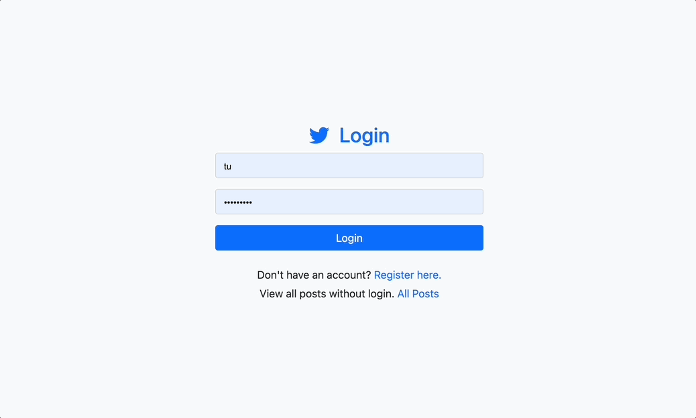
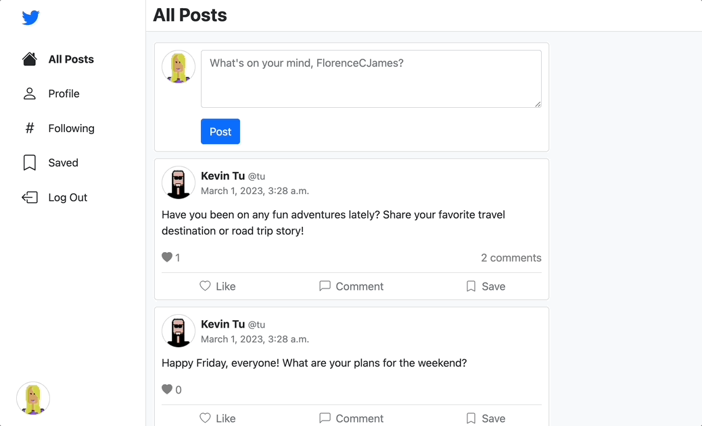
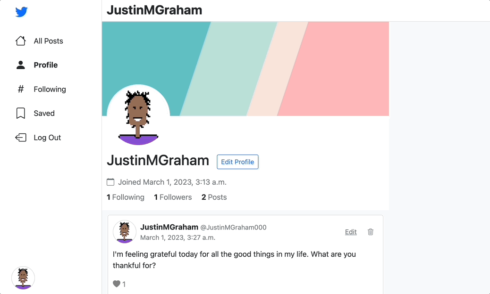

# Django-based Social Media Platform 

This is a Twitter-like social media platform built with Django, JavaScript, and Bootstrap. It allows users to create posts, comment on posts, follow other users, upload avatar/banner image, and etc.

## Key features

- **Post Creation:** Users can create new posts by typing a message and clicking the "Post" button. Posts are displayed in chronological order on the home page. 

- **Commenting:** Users can access the comments section by clicking on the "Comment" button located below each post. This will open up a comment modal that displays all the comments made to that post in chronological order. Users can participate in the conversation by adding their own comments at the bottom of the comment modal 

- **Following:** Users can follow other users by clicking the "Follow" button on a user's profile page. Posts from followed users are displayed on the home page.

- **Image Uploads:** Users can upload images to customize their avatar and the banner of their profile page.

<!-- ## Technologies used

- **Framework:** Utilized Django 
- **Responsive:**
- **User Interface:** -->
